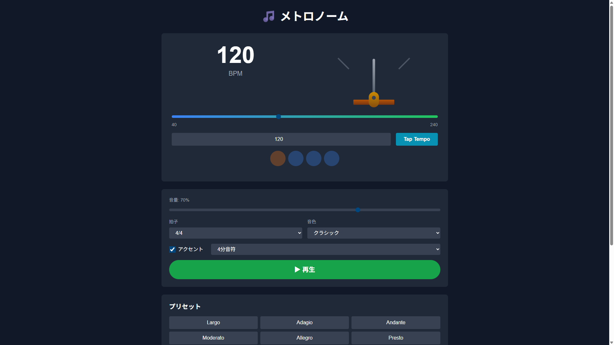

# 🎵 メトロノーム

[](https://nextjs.org/)
[](https://reactjs.org/)
[](https://www.typescriptlang.org/)
[](https://tailwindcss.com/)
[](https://web.dev/progressive-web-apps/)

シンプルで正確なメトロノームアプリ。Web Audio APIを使用した高精度なタイミング制御と、AI提案機能を搭載した次世代メトロノーム。

## ✨ 特徴

- **🎯 高精度タイミング** - Web Audio APIによる±5ms以内の正確なリズムキープ
- **🎨 ビジュアルメトロノーム** - 本物のメトロノームのように針が左右に揺れるアニメーション
- **🔊 音量調整** - 0〜100%で細かく調整可能
- **🤖 AI提案機能** - Google AI Studio (Gemini 2.5 Flash) によるリズムトレーニング提案
- **📱 PWA対応** - オフライン動作可能、ホーム画面に追加してアプリのように使える
- **🎼 豊富なカスタマイズ** - 5種類の音色、8種類の拍子、サブディビジョン対応
- **⚡ Tap Tempo** - タップしてBPMを自動検出

## 🎬 デモ

開発サーバーで起動後、`http://localhost:3000` でアクセス可能

## 📸 スクリーンショット



## 🎯 主要機能

### コア機能
- **BPM設定**: 40〜240 BPMの範囲で1 BPM刻みで設定可能
- **拍子**: 2/4, 3/4, 4/4, 5/4, 6/8, 7/8, 9/8, 12/8
- **音色**: クラシック、デジタル、ドラムスティック、ベル、シンセ
- **音量調整**: スライダーで0〜100%調整
- **アクセント**: 強拍（1拍目）の強調ON/OFF
- **サブディビジョン**: 4分音符、8分音符、16分音符、3連符

### ビジュアル機能
- **メトロノーム針アニメーション**: 本物のメトロノームのように針が左右に揺れる
- **ビートインジケーター**: 視覚的なリズム表示（円形インジケーター）
- **レスポンシブデザイン**: スマホ・タブレット・PCに最適化

### 高度な機能
- **Tap Tempo**: タップしてBPMを自動検出
- **9種類のプリセット**: Largo、Adagio、Andante、Moderato、Allegro、Presto、ロック、ジャズ、テクノ
- **AI提案**: リズムトレーニング提案 & ジャンル別BPM提案
  - APIキーなしでもデフォルト提案を表示
  - APIキー入力で自動保存（Gemini 2.5 Flash使用）
- **設定の自動保存**: 最後の設定をlocalStorageに保存

### PWA機能
- **オフライン動作**: Service Worker対応（今後実装予定）
- **インストール可能**: ホーム画面に追加してアプリとして使用
- **マルチサイズアイコン**: 72px〜512pxまで対応

## 🚀 技術スタック

- **フレームワーク**: Next.js 14 (App Router)
- **言語**: TypeScript 5
- **UI**: React 18
- **スタイリング**: Tailwind CSS v3
- **音声処理**: Web Audio API
- **AI**: Google AI Studio API (Gemini 2.5 Flash)
- **テスト**: Jest + React Testing Library + Playwright
- **開発手法**: TDD (Test-Driven Development)

## 📦 セットアップ方法

### 前提条件
- Node.js 18.x 以上
- npm または yarn

### インストール手順

```bash
# リポジトリをクローン
git clone https://github.com/yourusername/app034-metronome.git
cd app034-metronome

# 依存関係をインストール
npm install

# 開発サーバーを起動
npm run dev
```

### 起動方法

開発サーバー起動後、ブラウザで `http://localhost:3000` にアクセス

## 🧪 テスト

```bash
# ユニットテストを実行
npm test

# テストをウォッチモードで実行
npm run test:watch

# E2Eテストを実行（開発サーバーが起動している必要があります）
npm run test:e2e

# カバレッジレポート生成
npm test -- --coverage
```

### テストカバレッジ
- AudioEngine: 100%
- Metronome: 100%
- TapTempo: 100%
- Presets: 100%

## 🏗️ ビルド & デプロイ

```bash
# プロダクションビルド
npm run build

# プロダクションサーバーを起動
npm run start
```

## 📝 使い方

### 基本的な使い方

1. **BPMを設定**: スライダーまたは数値入力でBPMを設定
2. **音量を調整**: 音量スライダーで好みの音量に設定
3. **拍子を選択**: ドロップダウンから拍子を選択
4. **音色を選択**: お好みの音色を選択
5. **再生ボタンをクリック**: メトロノームが開始されます

### Tap Tempoの使い方

1. 「Tap Tempo」ボタンを2回以上タップ
2. タップの間隔から自動的にBPMが計算されます
3. 計算されたBPMが自動的に設定されます

### プリセットの使い方

1. プリセットボタンをクリック
2. そのプリセットの設定（BPM、拍子、音色など）が自動的に適用されます

### AI提案機能の使い方

#### APIキーなしの場合（デフォルト提案）
1. 「AI提案を生成」ボタンをクリック
2. BPM・拍子に応じたデフォルトのトレーニング提案が表示されます

#### APIキーありの場合（Gemini 2.5 Flash）
1. Google AI Studio APIキーを入力（自動保存）
2. 「AI提案を生成」ボタンをクリック
3. AIが生成したカスタム提案が表示されます
   - リズムトレーニング提案
   - ジャンル別BPM提案

## 🎯 TDD実装

このプロジェクトはTDD（テスト駆動開発）で実装されています：

- **Phase 0**: テスト環境構築
- **Phase 1**: AudioEngine実装（Web Audio API）
- **Phase 2**: Metronomeロジック実装
- **Phase 3**: TapTempo機能実装
- **Phase 4**: Presets機能実装
- **Phase 5**: Storage & AI統合
- **Phase 6**: UIコンポーネント実装
- **Phase 7**: 統合テスト & 最終調整

各Phaseで **Red → Green → Refactor** サイクルを実施しています。

## 🔧 技術的な特徴

### Web Audio API
- 高精度タイミング制御（±5ms以内）
- AudioContextを使用したスケジューリング
- 複数の音色生成（Oscillator使用）
- マスターボリュームコントロール

### パフォーマンス最適化
- スケジューラーの最適化
- 効率的なステート管理
- メモリリークの防止

### PWA対応
- Progressive Web App仕様準拠
- マニフェストファイル完備
- マルチサイズアイコン（72px〜512px）
- レスポンシブデザイン

## 📱 プロジェクト構造

```
app034-metronome/
├── app/                    # Next.js App Router
│   ├── page.tsx           # メインページ
│   ├── layout.tsx         # レイアウト（PWAメタデータ）
│   └── globals.css        # グローバルスタイル
├── lib/                    # ビジネスロジック
│   ├── audioEngine.ts     # Web Audio API制御
│   ├── metronome.ts       # メトロノームコア
│   ├── tapTempo.ts        # Tap Tempo機能
│   ├── presets.ts         # プリセット管理
│   ├── storage.ts         # LocalStorage管理
│   └── aiService.ts       # AI提案API
├── types/                  # TypeScript型定義
│   └── metronome.ts       # メトロノーム型
├── public/                 # 静的ファイル
│   ├── icons/             # PWAアイコン（72〜512px）
│   └── manifest.json      # PWAマニフェスト
├── __tests__/             # テストファイル
└── doc/                   # ドキュメント
    └── requirements.md    # 要件定義書
```

## 📚 開発ドキュメント

- [要件定義書](doc/requirements.md)

## 🤝 コントリビューション

プルリクエストを歓迎します！

1. このリポジトリをフォーク
2. フィーチャーブランチを作成 (`git checkout -b feature/amazing-feature`)
3. 変更をコミット (`git commit -m 'Add amazing feature'`)
4. ブランチにプッシュ (`git push origin feature/amazing-feature`)
5. プルリクエストを作成

## 📄 ライセンス

MIT License

## 👤 作者

**吉倉大晄 (Yoshikura Hiroaki)**
- GitHub: [@takamiya1021](https://github.com/takamiya1021)

## 🙏 謝辞

- [Next.js](https://nextjs.org/) - React フレームワーク
- [Tailwind CSS](https://tailwindcss.com/) - ユーティリティファーストCSS
- [Web Audio API](https://developer.mozilla.org/en-US/docs/Web/API/Web_Audio_API) - 高精度オーディオ処理
- [Google AI Studio](https://ai.google.dev/) - Gemini AI API

---

**App 34** - 100 Apps プロジェクト
